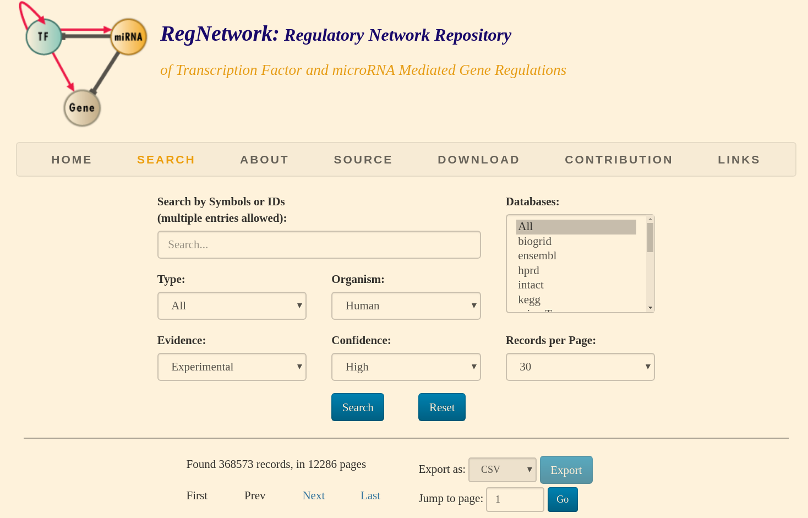

# Copyright statement


This work is licensed under a [Creative Commons Attribution-NonCommercial-ShareAlike 4.0 International License.](https://creativecommons.org/licenses/by-nc-sa/4.0/)
```{r include=FALSE, eval=FALSE}
<a rel="license" href="http://creativecommons.org/licenses/by-nc-sa/4.0/"></a><br />This work is licensed under a <a rel="license" href="http://creativecommons.org/licenses/by-nc-sa/4.0/">Creative Commons Attribution-NonCommercial-ShareAlike 4.0 International License</a>.
```

# Author information
**Tain Velasco-Luquez** (tvelasco@javeriana.edu.co). Bioinformatics and Systems Biology Group (GIBBS), Instituto de genética, Universidad Nacional de Colombia
Bogotá D.C., Colombia.

# Script description
The main objective of this script is to generate the human interactome (HI) including data from:
-PPI
-Metabosignal
-Regulatory

> Style guide is followed according to the [R style guide](https://google.github.io/styleguide/Rguide.xml#filenames) 

## Packages
```{r library, message=FALSE, warning=FALSE}
Packages <- c("ggplot2", "dplyr", "org.Hs.eg.db", "readr", "KEGGREST", "KEGGgraph", "parallel", "org.Hs.eg.db", "doParallel", "igraph", "tictoc"); lapply(Packages, library, character.only = TRUE); rm(Packages)
```

# Datasets importing
Complete raw data processing is described below, however, the fast way to load the final processed files is to run the following code chunk and jump to the "interactome assembly" section.
```{r}
load("Data/HIassembly.RData")
```

Which contains 3 data frames: PPI, regulatory and metabosignal. Each of them in turn has 3 columns: first two columns are the source and target nodes ENTREZID and the third column is the source of the interaction according to the name of the file.

## 0. Metabolic and Signaling interactions
[KEGG pathway](http://www.kegg.jp/kegg/docs/keggapi.html) database was used for metabolic and signaling data trough its (application programming interface) API for file retrieval. Data was downloaded on 03/05/2017. Two given nodes (*i.e.* metabolites, genes encoding enzymes denoted as metabolic and signaling-genes)  are connected if they are involved in the same pathway. In order to consider the inextricably intertwine between metabolic and signaling networks, they are going to be merge as a single one, instead of construct a separated network for each one [@RodriguezMartinez:2016cf]. 

```{r MetaboSignal, message=FALSE, warning=FALSE}
#library("MetaboSignal")

# Importing the file from the KEGG DB
KEGGpathID <- read.table(file = "http://rest.kegg.jp/link/hsa/pathway",
           header = FALSE,
           sep = "\t")

# Naming the Columns. Note that these are KEGG IDs
names(KEGGpathID) <- c("PathwayID",
                       "NodeID")

# Retrieving the signaling pathways for human from KEGG
KEGGsignalID <- as.data.frame(MS_FindKEGG(KEGG_database = "pathway",
                                   match = c("signal"),
                                   organism_code = "hsa"))

# Labeling each pathway as either signaling or metabolic
KEGGpathID$Source <- as.factor(ifelse(KEGGpathID$PathwayID == dplyr::intersect(KEGGpathID$PathwayID,
                                                                     KEGGsignalID$signal.path_ID),
                            "signal",
                            "metabolic"))

# Using grep-like function to delete unecesary words: "path:" from PathwayID and "hsa:" from NodeID. This functions change the class to character, so as.factor is required. Alternatively one can use all_paths = substr(names(lines), 6, 13) as described in MetaboSignal:::MS_interactionType
KEGGpathID$PathwayID <- gsub("path:",
                             "",
                             KEGGpathID$PathwayID)
KEGGpathID$NodeID <- gsub("hsa:",
                          "",
                          KEGGpathID$NodeID)

# Extracting the signaling and metabolic pathways
metaboPath <- unique(subset(x = KEGGpathID,
                     subset = Source == "metabolic",
                     select = PathwayID,
                     drop = TRUE))
signalPath <- unique(subset(x = KEGGpathID,
                     subset = Source == "signal",
                     select = PathwayID,
                     drop = TRUE))

# Creating the tissue specific metabosignal 2 dimensional matrix of directected edges (from left to right)
MetaboSignal <- MetaboSignal_matrix(metabo_paths = metaboPath,
                                    signaling_paths = signalPath,
                                    organism_name = "human",
                                    tissue = c("cerebellum",
                                               "hippocampus",
                                               "cerebral cortex",
                                               "caudate",
                                               "hypothalamus"),
                                    expand_genes = TRUE)

# Converting to igraph
metabosignalGraph <- graph_from_data_frame(MetaboSignal)

# Convertig to an undirected graph in a data frame format
MetaboSignal <- igraph::as_data_frame(as.undirected(metabosignalGraph,
                                                       mode = "collapse"))

# Converting from KEGG ID to entrez gene ID by removing the organism prefix
#metabosignalIGraph <- translateKEGGID2GeneID(metabosignalGraph,"hsa")
MetaboSignal$from <- gsub("hsa:",
                             "",
                             MetaboSignal$from)
MetaboSignal$to <- gsub("hsa:",
                          "",
                          MetaboSignal$to)
MetaboSignal$from <- gsub("cpd:",
                             "",
                             MetaboSignal$from)
MetaboSignal$to <- gsub("cpd:",
                          "",
                          MetaboSignal$to)

# Adding the source column
MetaboSignal$Source <- "metabosignal"
names(MetaboSignal) <- c("EG_node1",
                         "EG_node2",
                         "Source")
MetaboSignal <- unique(MetaboSignal)

# Export the file
write.table(MetaboSignal,
            file = "Data/Individual/metabosignal_ready.txt",
            append = FALSE,
            quote = FALSE,
            sep = "\t",
            row.names = FALSE,
            col.names = TRUE,
            qmethod = c("escape",
                        "double"))

# Cleaning the environment
rm(KEGGpathID, KEGGsignalID, metabosignalIGraph, MetaboSignalUnfilter, neglectedNodes, signalPath, metaboPath)

```

### 0.0 Summary
Number of proteins: `r vcount(metabosignalGraph)`

Number of physical interactions among proteins:`r ecount(metabosignalGraph)`

Diameter: `r diameter(metabosignalGraph)`

## 1. Regulatory interactions
Regulatory interactions come from [RegNetwork](http://www.regnetworkweb.org/), a databse for five types of regulatory interactions for human and mouse. RegNetwork enables using interactions supported by wet lab experiemnts and with a high confidence. Data was downloaded on 18/03/2019. The download options were:



```{r regulatory, message=FALSE, warning=FALSE}
library("hpar")
RegNet <- read_csv("Data/Individual/export_Mon_Mar_18_13_56_38_UTC_2019.csv")
dim(RegNet)

# Lets filter the tissue specific interactions
data("rnaGeneTissue")
rnaGeneTissue <- filter(rnaGeneTissue, Sample == "cerebral cortex")
RegNet_tissue_specific <- semi_join(RegNet, rnaGeneTissue, c("regulator_symbol" = "Gene.name"))
RegNet_tissue_specific <- semi_join(RegNet_tissue_specific, rnaGeneTissue, c("target_symbol" = "Gene.name"))
dim(RegNet_tissue_specific) # 9038    7
RegNet_tissue_specific <- RegNet_tissue_specific[, c(2, 4)]
names(RegNet_tissue_specific) <- c("EG_node1", "EG_node2")
RegNet_tissue_specific$Source <- "regulatory"

# To avoid errors when mergin the files, it is better to treat ENTREZIDs as character instead of numeric
RegNet_tissue_specific[,1] <- as.character(RegNet_tissue_specific[,1])
RegNet_tissue_specific[,2] <- as.character(RegNet_tissue_specific[,2])

# Saving the file
write.table(RegNet_tissue_specific, "Data/Individual/regulatory_ready.txt", sep = "\t", col.names = T, row.names = F, quote = F)

# Creating the graph
reGraph <- igraph::graph_from_data_frame(RegNet_tissue_specific, directed = F)

# Cleaning the environment
rm(rnaGeneTissue, RegNet, RegNet_tissue_specific)
```

### 1.0 Summary
Number of proteins: `r vcount(reGraph)`

Number of physical interactions among proteins:`r ecount(reGraph)`

Diameter: `r diameter(reGraph)`

## 2. Binary protein-protein physical interactions 
Protein-Portein interactions (PPI) come from [APID](http://cicblade.dep.usal.es:8080/APID/init.action) level 2 interactions, derived from high-throughput (unbiased) and low-troughput (typically biased) tecnologies [@Rolland:2014cl], including PPI experimentally curated with at least 2 separated papers reporting the interaction. Downloaded on 02/02/2017. PPI were filtered by the same [hpar](http://bioconductor.org/packages/release/bioc/html/hpar.html) tissues as metaboSignal and regulatory. 

```{r PPI, message=FALSE, warning=FALSE}
APID <- read_delim(file = "Data/Individual/APID_level3.txt", "\t", escape_double = FALSE, trim_ws = TRUE)

# Subsetting by Uniprot ID
APID <- APID[, c(1,2,5)]

# Tissue specific filtering. But first lets map the UniprotID to Ensembl Id as HPAR request
keys <- unique(c(unique(APID$UniprotID_A), unique(APID$UniprotID_B)))

UNIPROTID2ENSEMBL <- AnnotationDbi::select(org.Hs.eg.db, keys, c("ENSEMBL", "UNIPROT"), "UNIPROT")

APID_ENSEMBLID <- dplyr::inner_join(APID, UNIPROTID2ENSEMBL, c("UniprotID_A" = "UNIPROT")); APID_ENSEMBLID <- dplyr::inner_join(APID_ENSEMBLID, UNIPROTID2ENSEMBL, c("UniprotID_B" = "UNIPROT"))
```

Because UNIPROTID to ENSEMBLID has 1 to many mapping, number of edges in the network increase. This is an artifact as it is the same vertex but with different ID, so it is required to remove this. Fortunatelly, APID has an unique interactionID:

```{r PPI_1, message=FALSE, warning=FALSE}
APID_ENSEMBLID <- dplyr::distinct(APID_ENSEMBLID, InteractionID, .keep_all = T) 
dim(APID_ENSEMBLID) 

# Lets drop NAs:
any(is.na(APID_ENSEMBLID))
APID_ENSEMBLID <- APID_ENSEMBLID[complete.cases(APID_ENSEMBLID),]
dim(APID_ENSEMBLID)
```

There are 42856 edges left after the ID mapping

```{r PPI_2, message=FALSE, warning=FALSE}
library("hpar")
data("hpaNormalTissue")
hpaNormalTissue <- dplyr::filter(hpaNormalTissue,
Reliability == "Supportive" | Reliability == "Approved",
Level == "High" | Level == "Low" | Level == "Medium",
Tissue == "hippocampus" | Tissue == "hypothalamus" | Tissue == "caudate" | Tissue == "cerebellum" | Tissue == "cerebral cortex")

APID_ready <- dplyr::semi_join(APID_ENSEMBLID,
                        hpaNormalTissue,
                        by = c("ENSEMBL.x" = "Gene"));APID_ready <- dplyr::semi_join(APID_ready,
                        hpaNormalTissue,
                        by = c("ENSEMBL.y" = "Gene"))
```
Now that we have the tissue-specific interactions, lets map them to the ENTREZ ID:

```{r PPI_3, message=FALSE, warning=FALSE}
keys <- unique(c(unique(APID_ready$ENSEMBL.x), unique(APID_ready$ENSEMBL.y)))

ENSEMBL2EG <- AnnotationDbi::select(org.Hs.eg.db, keys, c("ENSEMBL", "ENTREZID"), "ENSEMBL")
APID_ready <- dplyr::inner_join(APID_ready, ENSEMBL2EG, c("ENSEMBL.x" = "ENSEMBL")); APID_ready <- dplyr::inner_join(APID_ready, ENSEMBL2EG, c("ENSEMBL.y" = "ENSEMBL"))

# Removing duplicates
APID_ready <- dplyr::distinct(APID_ready, InteractionID, .keep_all = T) 

# Selecting onlythe ENTREZ ID columns
APID_ready <- APID_ready[,6:7]

# Removing NAs
APID_ready <- APID_ready[complete.cases(APID_ready),]

# Renaming
names(APID_ready) <- c("EG_node1",
                "EG_node2")
# Adding the source
APID_ready$Source <- "ppi"

# Converting ENTREZIDs to character
APID_ready$EG_node1 <- as.character(APID_ready$EG_node1)
APID_ready$EG_node2 <- as.character(APID_ready$EG_node2)
APID_ready$Source <- as.factor(APID_ready$Source)

# Exporting the file
write.table(APID_ready, file = "Data/Individual/ppi_ready.txt",
            append = FALSE,
            quote = FALSE,
            sep = "\t",
            row.names = FALSE,
            col.names = TRUE,
            qmethod = c("escape",
                        "double"))

# Creating the graph
PPIGraph <- graph_from_data_frame(APID_ready[,1:2],
                                  directed = FALSE) 

# Cleaning the environment
rm(APID_ready,
   APID_ENSEMBLID,
   hpaNormalTissue,
   UNIPROTID2ENSEMBL,
   APID,
   keys,
   ENSEMBL2EG)
```

### 2.0 Summary
Number of proteins: `r vcount(PPIGraph)`

Number of physical interactions among proteins:`r ecount(PPIGraph)`

Diameter: `r diameter(PPIGraph)`

# Interactome assembly
Lets merge the files to create the brain-specific human interactome (HI).

```{r interactome, message=FALSE, warning=FALSE}
# Merging the files and deleting duplicate entries
interactome <- unique(dplyr::bind_rows(PPI,
                                metabosignal,
                                regulatory))

# Creating the interactome igraph object
interactomeGraph <- graph_from_data_frame(interactome,
                                          directed = FALSE)

# For the sake of simplicity only the largest connected componnent (LCC) will be used to perform the validation analyses [@Kolaczyk:2014cu, p. 57]:
# Finding the number of components (number of columns sum of second row) and their vertex number (upper row)
table(sapply(decompose.graph(interactomeGraph),
             vcount))

LCC <- which(sapply(decompose.graph(interactomeGraph),
             vcount) == 7937)
# Extracting only the LCC
interactomeGraph.LCC <- decompose.graph(interactomeGraph)[[LCC]]

# Percentage of nodes in the giant component or LCC
(vcount(interactomeGraph.LCC) * 100) / vcount(interactomeGraph)

# Percentage of interactions in the LCC
(ecount(interactomeGraph.LCC) * 100) / ecount(interactomeGraph)

# Converting the igraph object back to data frame to exporting it
interactome <- igraph::as_data_frame(interactomeGraph.LCC)
names(interactome) <- c("EG_node1","EG_node2", "Source")
interactome <- unique(interactome)
```
```{r}
# Exporting the file
write.table(interactome,
            file = "Data/Individual/interactome_ready.txt",
            quote = FALSE,
            sep = "\t",
            row.names = FALSE,
            col.names = TRUE)

saveRDS(interactome, "Data/Individual/interactome_ready.rds")

# Plot of proportion of interactions per source
ggplot(interactome, aes(x = "", fill = Source)) + 
  geom_bar(position = "fill", width = 0.3) +
  scale_fill_manual(values = c("tomato", "gold", "gray50")) +
  labs(x = "", y = "Proportion of edges") +
  theme(legend.position = "bottom", legend.box = "horizontal")

```

### Summary
Number of proteins: `r vcount(interactomeGraph.LCC)`

Number of physical interactions among proteins:`r ecount(interactomeGraph.LCC)`

Diameter: `r diameter(interactomeGraph.LCC)`

***
# References